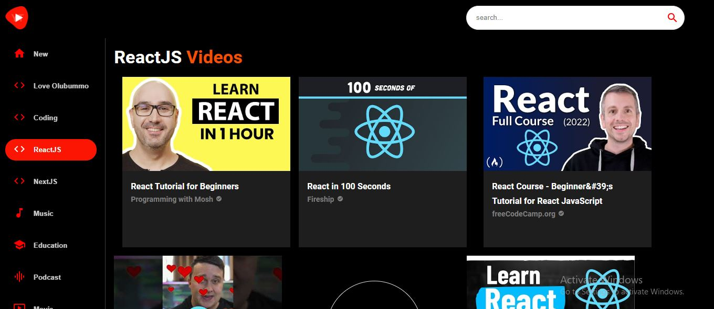

# Getting Started with youtube-clone App

With the aim of creating a mock-up of youtube with the help of rapid api [ytdlfree](https://rapidapi.com/ytdlfree/api/youtube-v31), this project was built

## Site-Navigation Video

## Screenshots

## Methodologies | Frameworks | Syntax | api

React(useState, useEffect, useParams), Material ui(Box, Card, Stack, CardContent, CardMedia, Typography, Paper, CheckCircle, Search, IconButton), css,

### api

- [rapid-api](https://rapidapi.com/hub)

## Deployment

visit youtube-clone at: [vercel]()

## Available Scripts

In the project directory, you can run:

### `npm start`

Runs the app in the development mode.\
Open [http://localhost:3000](http://localhost:3000) to view it in your browser.

The page will reload when you make changes.\
You may also see any lint errors in the console.
